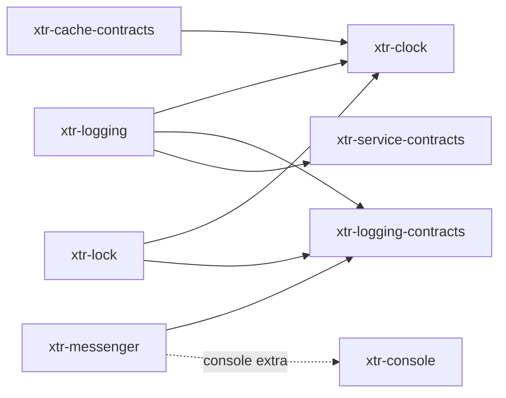

<div align="center">

# xtr

**Small, typed, async-ready building blocks for Python applications — one repository, one package each.**


</div>

---

Each directory under [`packages/`](packages) is an independent distribution with its own version,
dependencies, tests and README. They are developed together here so a change that crosses
packages is one commit, and released separately so an application installs only what it uses.

## Packages

| Package | What it is |
|---|---|
| [xtr-cache-contracts](packages/xtr-cache-contracts) | The caching interfaces alone: fetch-or-compute, item pools, tags and namespaces. |
| [xtr-clock](packages/xtr-clock) | An injectable clock, a timezone-aware `DatePoint`, and a frozen clock for tests. |
| [xtr-console](packages/xtr-console) | Async-native console applications: commands as functions or classes, wired by a container. |
| [xtr-dependency-injection](packages/xtr-dependency-injection) | A bundle and kernel layer for Python, compiled to a wireup container. |
| [xtr-dotenv](packages/xtr-dotenv) | Layered `.env` files loaded into the environment, and the same layers behind a typed settings model. |
| [xtr-event-dispatcher-contracts](packages/xtr-event-dispatcher-contracts) | The event dispatching interfaces alone, for libraries that emit events without choosing who hears them. |
| [xtr-logging](packages/xtr-logging) | Channels, handlers, processors and formatters behind one logger interface. |
| [xtr-logging-contracts](packages/xtr-logging-contracts) | The logging interface alone, for libraries that log but should not choose how. |
| [xtr-messenger](packages/xtr-messenger) | A message bus: envelopes, stamps, a middleware chain and pluggable transports. |
| [xtr-service-contracts](packages/xtr-service-contracts) | What a container drives on a service, not what the service does. No dependencies. |
| [xtr-lock](packages/xtr-lock) | Exclusive and shared locks around resources, in memory, in files, in Redis, or across several stores. |
| [xtr-scheduler](packages/xtr-scheduler) | Recurring messages on xtr-messenger. Not implemented yet. |

How they depend on each other (runtime dependencies only; extras are dotted):



The contracts packages exist so a library can depend on an interface without installing its
implementation: [xtr-messenger](packages/xtr-messenger) logs through `xtr-logging-contracts`, and
the application decides whether `xtr-logging` is behind it.

## Install

Each package is published to PyPI on its own:

```sh
uv add xtr-logging
uv add "xtr-messenger[amqp]"
```

`xtr-scheduler` is published only to hold its name; there is nothing in it yet.

## Versions

Every package shares one version and is released together, even one that did not change — any
two `xtr-*` packages at the same version are known to work together. Packages require their
siblings by major version (`xtr-logging-contracts>=1.0,<2`).

[`scripts/release.py`](scripts/release.py) keeps that consistent:

```sh
uv run scripts/release.py check        # every package is on one version (CI runs this)
uv run scripts/release.py bump 1.1.0   # move every package; on a new major, rewrite the ranges
```

A package classified `Private :: Do Not Upload` moves with the rest but is never published or
split.

## Releasing

```sh
uv run scripts/release.py bump 1.1.0
git commit -am "bump: 1.1.0" && git push
git tag 1.1.0 && git push origin 1.1.0
```

The tag starts the [release workflow](.github/workflows/release.yml): it checks the tag against
the packages' version, publishes every package to PyPI through trusted publishing, and tags each
read-only repository `1.1.0`.

## Repositories

This repository is where everything is developed. Each published package is also copied, on
every push to `main`, into a repository of its own — `xterr/python-<package>`, e.g.
[python-xtr-logging](https://github.com/xterr/python-xtr-logging) — which carries only that
package's directory and history, and its release tags. Those copies are read-only: pull requests
there are closed automatically, so send issues and pull requests here.

## Development

Requires [uv](https://docs.astral.sh/uv/). The repository is a
[uv workspace](https://docs.astral.sh/uv/concepts/projects/workspaces/): one lockfile, one
virtual environment, and every package installed editable, so a change in one package is
immediately visible to the packages that use it.

```sh
git clone git@github.com:xterr/python-xtr.git
cd python-xtr
uv sync --all-packages
uv run pre-commit install
```

The pre-commit hook runs ruff on what you commit and the tests of every package you touched.
[CI](.github/workflows/ci.yml) runs everything, for every package, on Python 3.11 and 3.14.

Work inside a package directory; each carries its own pytest, ruff, basedpyright and ty settings:

```sh
cd packages/xtr-logging
uv run pytest
uv run ruff check
uv run ruff format --check
uv run basedpyright
uv run ty check
```

To run one package against only the dependencies it declares, from the repository root:

```sh
uv run --package xtr-logging --exact pytest packages/xtr-logging
```

This is the check that catches a package importing a sibling it never listed in its
`pyproject.toml` — something the shared environment would otherwise hide.

### Creating a package

Every package follows the same shape. Rules that apply to code, tests, docs and commit
messages live in [AGENTS.md](AGENTS.md); this section is the mechanical checklist.

A package contains: a `pyproject.toml` at the current shared version, a
`src/xtr_<name>/` importable package with `py.typed`, tests under `tests/`, a `README.md`
starting with the package's one-line pitch, and a `LICENSE`. A package integrates with
[xtr-dependency-injection](packages/xtr-dependency-injection) through a bundle under
`src/xtr_<name>/bundle/`.

#### Directory template

```
packages/xtr-<name>/
├── pyproject.toml
├── README.md
├── LICENSE
├── src/xtr_<name>/
│   ├── __init__.py
│   ├── py.typed
│   ├── <thing>.py                 # one public class per file
│   ├── <thing>_interface.py       # @runtime_checkable Protocol
│   ├── exception/
│   │   ├── __init__.py
│   │   ├── <name>_error.py        # package base error
│   │   └── <specific>_error.py
│   └── bundle/
│       ├── __init__.py
│       ├── <name>_bundle.py
│       └── <name>_config.py
└── tests/
    ├── conftest.py
    ├── unit/
    ├── integration/
    ├── fixtures/
    └── support/
```

#### `pyproject.toml`

```toml
[project]
name = "xtr-<name>"
version = "1.1.0"
description = "<one-line pitch, on this project's own terms>."
readme = "README.md"
requires-python = ">=3.11"
license = "MIT"
license-files = ["LICENSE"]
authors = [
    { name = "Razvan Ceana", email = "razvan@ceana.ro" }
]
keywords = ["<name>"]
classifiers = [
    "Development Status :: 3 - Alpha",
    "Intended Audience :: Developers",
    "Programming Language :: Python :: 3.11",
    "Programming Language :: Python :: 3.12",
    "Programming Language :: Python :: 3.13",
    "Programming Language :: Python :: 3.14",
    "Typing :: Typed",
]
dependencies = []

[project.optional-dependencies]
di = [
    "xtr-dependency-injection>=1.0,<2",
]

[dependency-groups]
dev = [
    "basedpyright>=1.21",
    "ruff>=0.8",
    "pytest>=8",
    "anyio>=4.0",
    "ty>=0.0.83",
    "xtr-dependency-injection>=1.0,<2",
]

[build-system]
requires = ["uv_build>=0.9.18,<0.10.0"]
build-backend = "uv_build"

[tool.basedpyright]
typeCheckingMode = "all"
pythonVersion = "3.11"
pythonPlatform = "All"
include = ["src", "tests"]
exclude = ["**/__pycache__", "**/.venv", "**/build", "**/dist", ".tmp"]
reportUnusedCallResult = "warning"
reportUnnecessaryTypeIgnoreComment = "error"
reportUnusedVariable = "error"
reportMissingParameterType = "error"
reportPrivateUsage = "error"

[tool.ruff]
target-version = "py311"
line-length = 100
src = ["src", "tests"]

[tool.ruff.lint]
select = ["ALL"]
ignore = ["COM812", "ISC001", "D203", "D213", "CPY001", "FBT001", "FBT002", "TD002", "TD003", "FIX002"]
fixable = ["ALL"]
unfixable = []

[tool.ruff.lint.per-file-ignores]
"tests/**/*.py" = ["S101", "ARG", "PLR2004", "SLF001", "D"]

[tool.ruff.lint.pydocstyle]
convention = "google"

[tool.ruff.format]
quote-style = "double"
indent-style = "space"

[tool.ty.src]
include = ["src", "tests"]

[tool.pytest.ini_options]
minversion = "8.0"
testpaths = ["tests"]
addopts = ["-ra", "--strict-config", "--strict-markers"]
filterwarnings = ["error"]
```

Packages never declare their own `[tool.uv.sources]`; the root maps every `xtr-*` name to
the workspace.

#### `src/xtr_<name>/__init__.py`

```python
"""<one-line pitch, on this project's own terms>."""

from __future__ import annotations

__all__ = []
```

An empty `src/xtr_<name>/py.typed` sits next to it.

#### Bundle and config

The bundle is optional — a library without a container works as it stands — but the shape is
fixed so every application configures every package the same way. Read
[`packages/xtr-dependency-injection/README.md`](packages/xtr-dependency-injection/README.md)
for what each hook means; the template below is a working starting point.

```python
# src/xtr_<name>/bundle/<name>_config.py
"""Configuration for the <name> bundle."""

from __future__ import annotations

from dataclasses import dataclass

__all__ = ["<Name>Config"]


@dataclass(frozen=True, slots=True)
class <Name>Config:
    """Values the bundle builds from. Must be buildable with no arguments."""

    # example field; delete or replace
    option: str = "default"

    def __post_init__(self) -> None:
        """Validate combinations that dataclass defaults cannot express."""
```

```python
# src/xtr_<name>/bundle/<name>_bundle.py
"""The xtr-<name> bundle."""

from __future__ import annotations

from typing import final

from typing_extensions import override
from xtr_dependency_injection import Bundle, ContainerBuilder, ServiceConfigurator, as_bundle

from .<name>_config import <Name>Config

__all__ = ["<Name>Bundle"]


@final
@as_bundle("<name>", config=<Name>Config)
class <Name>Bundle(Bundle[<Name>Config]):
    """Registers the <name> services under the container."""

    @override
    def load_extension(
        self,
        config: <Name>Config,
        services: ServiceConfigurator,
        builder: ContainerBuilder,
    ) -> None:
        """Register services on the container from ``config``."""
        del builder, config, services  # replace with real registrations
```

```python
# src/xtr_<name>/bundle/__init__.py
"""The xtr-dependency-injection bundle for xtr-<name>."""

from __future__ import annotations

from .<name>_bundle import <Name>Bundle
from .<name>_config import <Name>Config

__all__ = ["<Name>Bundle", "<Name>Config"]
```

#### Tests

Unit tests mirror `src/xtr_<name>/` one-for-one under `tests/unit/`. Every bundle has a
zero-config test:

```python
# tests/unit/bundle/test_<name>_bundle.py
"""The <name> bundle honours the zero-config contract."""

from __future__ import annotations

import pytest
from xtr_dependency_injection.testing import assert_zero_config

from xtr_<name>.bundle import <Name>Bundle


@pytest.mark.anyio
async def test_it_builds_and_boots_with_no_configuration() -> None:
    await assert_zero_config(<Name>Bundle)
```

```python
# tests/conftest.py
"""Shared test fixtures."""

from __future__ import annotations

import pytest


@pytest.fixture
def anyio_backend() -> str:
    return "asyncio"
```

#### README skeleton

````markdown
<div align="center">

# xtr-<name>

**<one-line pitch>.**

</div>

---

## Why?

## Install

```sh
uv add xtr-<name>
```

## Quick start

## Kernel / bundle

## Development

## License

MIT — see [LICENSE](LICENSE).
````

#### Registering the package

1. Add `xtr-<name> = { workspace = true }` to `[tool.uv.sources]` in the root
   [`pyproject.toml`](pyproject.toml).
2. Add a row to the [Packages table](#packages) at the top of this README.
3. Run `uv lock` from the repository root.
4. Create the empty `xterr/python-xtr-<name>` repository on GitHub (the split workflow
   populates it on every push to `main`).
5. Register a pending trusted publisher for `xtr-<name>` on PyPI before its first release.

If a sibling's version leaves a range, `uv lock` fails; that is the reminder to update the
range.

## Layout

```
python-xtr/
├── .github/workflows/  # ci, release, split
├── packages/
│   └── xtr-<name>/
│       ├── .github/    # only for the read-only copy: closes its pull requests
│       ├── src/xtr_<name>/
│       ├── tests/
│       ├── pyproject.toml
│       ├── README.md
│       └── LICENSE
├── scripts/release.py  # one version for every package
├── pyproject.toml      # workspace root: members and sources, never published
└── uv.lock             # the only lockfile
```

## License

MIT — see [LICENSE](LICENSE). Every package ships the same license in its own directory.
