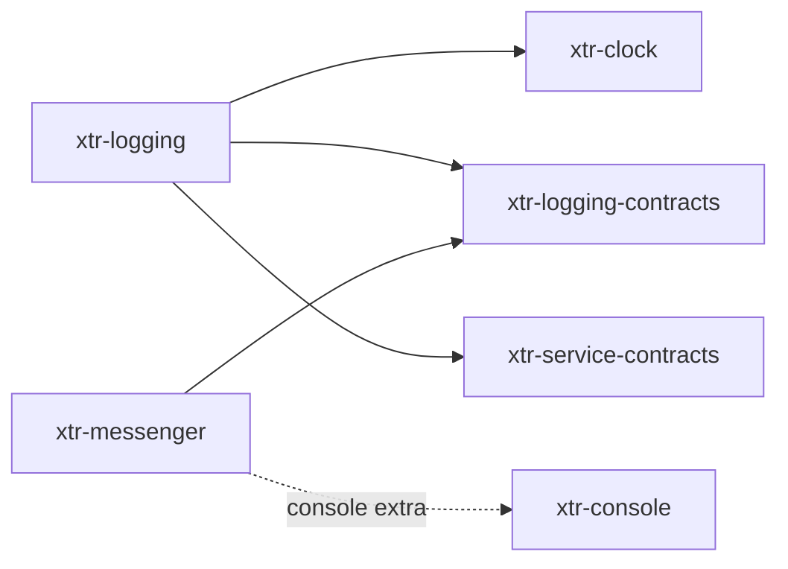

<div align="center">

# xtr

**Small, typed, async-ready building blocks for Python applications — one repository, one package each.**


</div>

---

Each directory under [`packages/`](packages) is an independent distribution with its own version,
dependencies, tests and README. They are developed together here so a change that crosses
packages is one commit, and released separately so an application installs only what it uses.

## Packages

| Package | What it is |
|---|---|
| [xtr-clock](packages/xtr-clock) | An injectable clock, a timezone-aware `DatePoint`, and a frozen clock for tests. |
| [xtr-console](packages/xtr-console) | Async-native console applications: commands as functions or classes, wired by a container. |
| [xtr-dependency-injection](packages/xtr-dependency-injection) | A Symfony-style bundle and kernel layer, compiled to a wireup container. |
| [xtr-logging](packages/xtr-logging) | Channels, handlers, processors and formatters behind one logger interface. |
| [xtr-logging-contracts](packages/xtr-logging-contracts) | The logging interface alone, for libraries that log but should not choose how. |
| [xtr-messenger](packages/xtr-messenger) | A message bus: envelopes, stamps, a middleware chain and pluggable transports. |
| [xtr-service-contracts](packages/xtr-service-contracts) | What a container drives on a service, not what the service does. No dependencies. |
| [xtr-lock](packages/xtr-lock) | Planned — not implemented or published yet. |
| [xtr-scheduler](packages/xtr-scheduler) | Planned — not implemented or published yet. |

How they depend on each other (runtime dependencies only; extras are dotted):



The contracts packages exist so a library can depend on an interface without installing its
implementation: [xtr-messenger](packages/xtr-messenger) logs through `xtr-logging-contracts`, and
the application decides whether `xtr-logging` is behind it.

## Install

Each package is published to PyPI on its own:

```sh
uv add xtr-logging
uv add "xtr-messenger[amqp]"
```

`xtr-lock` and `xtr-scheduler` are placeholders and are not published.

## Versions

Versioned the way Symfony versions its components, in two groups:

| Group | Packages | Tag |
|---|---|---|
| Libraries | every package not named `*-contracts` | `vX.Y.Z` |
| Contracts | `xtr-logging-contracts`, `xtr-service-contracts` | `contracts-vX.Y.Z` |

Every package in a group shares one version and is released together, even when it did not
change, so any two libraries at the same version are known to work together. The contracts move
on their own: an interface that rarely changes should not force every implementation to follow
each library release.

Packages require their siblings by major version (`xtr-logging-contracts>=1.0,<2`).
[`scripts/release.py`](scripts/release.py) keeps all of that consistent:

```sh
uv run scripts/release.py check                  # each group is on one version (CI runs this)
uv run scripts/release.py bump libraries 1.1.0   # move a group; on a new major, rewrite the ranges
```

A package classified `Private :: Do Not Upload` moves with its group but is never published or
split.

## Releasing

1. `uv run scripts/release.py bump libraries 1.1.0`, commit, push.
2. Tag the commit `v1.1.0` (or `contracts-v1.1.0`) and push the tag.

The [release workflow](.github/workflows/release.yml) checks the tag against the group's version,
builds every package of the group and publishes them to PyPI through trusted publishing. The
[split workflow](.github/workflows/split.yml) pushes the same tag to each package's repository.

## Repositories

This repository is where everything is developed. Each published package is also copied, on
every push to `main`, into a repository of its own — `xterr/python-<package>`, e.g.
[python-xtr-logging](https://github.com/xterr/python-xtr-logging) — which carries only that
package's directory and history, and its release tags. Those copies are read-only: pull requests
there are closed automatically, so send issues and pull requests here.

## Development

Requires [uv](https://docs.astral.sh/uv/). The repository is a
[uv workspace](https://docs.astral.sh/uv/concepts/projects/workspaces/): one lockfile, one
virtual environment, and every package installed editable, so a change in one package is
immediately visible to the packages that use it.

```sh
git clone git@github.com:xterr/python-xtr.git
cd python-xtr
uv sync --all-packages
uv run pre-commit install
```

The pre-commit hook runs ruff on what you commit and the tests of every package you touched.
[CI](.github/workflows/ci.yml) runs everything, for every package, on Python 3.11 and 3.14.

Work inside a package directory; each carries its own pytest, ruff, basedpyright and ty settings:

```sh
cd packages/xtr-logging
uv run pytest
uv run ruff check
uv run ruff format --check
uv run basedpyright
uv run ty check
```

To run one package against only the dependencies it declares, from the repository root:

```sh
uv run --package xtr-logging --exact pytest packages/xtr-logging
```

This is the check that catches a package importing a sibling it never listed in its
`pyproject.toml` — something the shared environment would otherwise hide.

### Adding a package

1. Create `packages/xtr-<name>/` with a `pyproject.toml` at its group's current version,
   `src/xtr_<name>/`, `README.md` and `LICENSE`. The workspace picks up anything matching
   `packages/xtr-*`.
2. Add `xtr-<name> = { workspace = true }` to `[tool.uv.sources]` in the root `pyproject.toml`.
3. Run `uv lock`.
4. Create the empty `xterr/python-xtr-<name>` repository on GitHub, and a pending trusted
   publisher for it on PyPI, before its first release.

Packages never declare their own `[tool.uv.sources]`; the root maps every `xtr-*` name to the
workspace. If a sibling's version leaves a range, `uv lock` fails, which is the reminder to
update the range.

## Layout

```
python-xtr/
├── .github/workflows/  # ci, release, split
├── packages/
│   └── xtr-<name>/
│       ├── .github/    # only for the read-only copy: closes its pull requests
│       ├── src/xtr_<name>/
│       ├── tests/
│       ├── pyproject.toml
│       ├── README.md
│       └── LICENSE
├── scripts/release.py  # versions of each group
├── pyproject.toml      # workspace root: members and sources, never published
└── uv.lock             # the only lockfile
```

## License

MIT — see [LICENSE](LICENSE). Every package ships the same license in its own directory.
